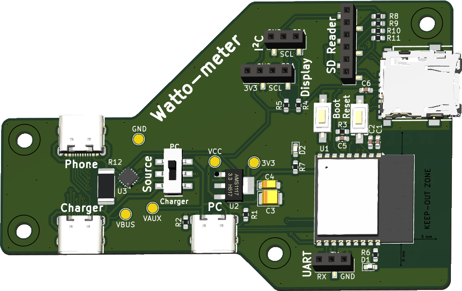

# Watto-Meter

## Description

Watto-Meter is an open-source project designed to measure the power consumption of a device connected via USB-C. This project combines dedicated hardware and embedded software to provide the following features:

- **Power measurement**: Voltage, current, and power are measured.
- **Data logging**: Measurements are saved on an SD card in CSV format.
- **Web interface**: Data is accessible via a web page hosted on the device. The interface also allows:
  - Starting or stopping measurements.
  - Downloading or deleting recorded CSV files.
- **Web API**: A REST API enables remote control of the device and access to the data.

## Key Features

1. **Measurement**:
   - Voltage (Volts)
   - Current (mA)
   - Power (Watts)

2. **Data logging**:
   - Measurements are saved on an SD card in CSV format.

3. **User interface**:
   - An intuitive web interface to view data, configure the device, and manage recorded files.

4. **REST API**:
   - Remote control via HTTP endpoints to start/stop measurements, configure the device, or download files.

---

## Open-Source Hardware

The hardware for Watto-Meter is also open-source, created by @Hyrla. All the files required to manufacture the PCB and assemble the device are available in the [`hardware/`](hardware/) folder.

### Hardware Image

Below is an image of the Watto-Meter hardware:

<div style="text-align:center"></div>


---

## Software Development and Deployment

<div style="text-align:center"></div>

### Prerequisites

- [PlatformIO Core](https://docs.platformio.org/page/core.html)
- A Watto-Meter board (see the [`hardware/`](hardware/) folder)
- An SD card for data logging

### Instructions

1. **Clone the project**:
   ```bash
   git clone https://github.com/esiealab/watto-meter.git
   cd watto-meter/software
   ```

2. **Configure the project**:
   - Open the folder in PlatformIO.
   - Edit the [`platformio.ini`](software/platformio.ini) file if necessary and the [`WiFiConfig.h`](software/include/WiFiConfig.h) (WiFi SSID, password.).

3. **Build and upload the firmware**:
   ```bash
   pio run --target upload
   ```

4. **Upload folder [`data`](software/data/) to the filesystem**:
According to [this guide](https://randomnerdtutorials.com/esp32-vs-code-platformio-spiffs/):
   ```bash
   #Build the filesystem image
   pio run --target buildfs
   #Upload the filesystem image
   pio run --target uploadfs
   ```
Or you can open the PlatformIO menu and click on the following buttons:

<div style="text-align:center"></div>

---

## License

This project is licensed under the MIT License. You are free to use, modify, and distribute it, provided you retain the copyright notice.

---