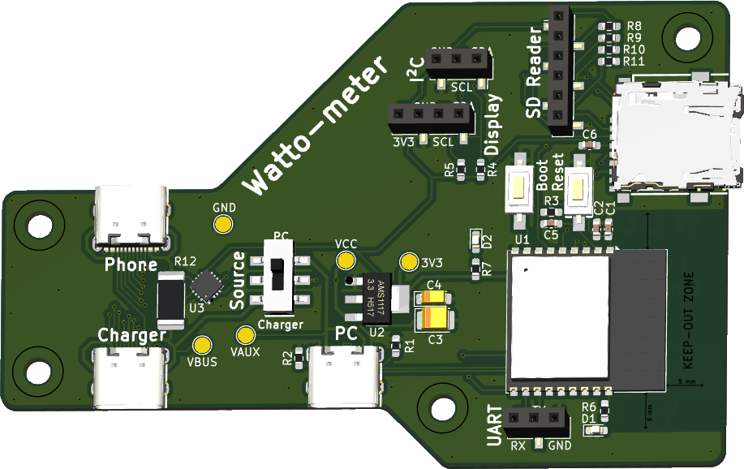

## Open-Source Hardware

The hardware for Watto-Meter is also open-source, created by [@Hyrla](https://github.com/Hyrla). All the files required to manufacture the PCB and assemble the device are available in the [`hardware/`](hardware/) folder.

### Hardware Image

Below is an image of the Watto-Meter hardware:

### Ordering the PCB on JLCPCB

To manufacture the PCB, you can use JLCPCB's fabrication service. Follow these steps:

1. **Download the Gerber files**:
   - The Gerber files required for fabrication are located in the [`hardware/`](hardware/) folder.

2. **Create an account on JLCPCB**:
   - Visit [https://jlcpcb.com](https://jlcpcb.com) and create an account.

3. **Upload the Gerber files**:
   - Click "Quote Now" and upload the Gerber files for the project.

4. **Configure fabrication options**:
   - Select your desired options (PCB color, thickness, etc.).

5. **Order components**:
   - If you want the PCB assembled, upload the Bill of Materials (BOM) and Component Placement List (CPL) files available in the [`hardware/production/`](hardware/production/) folder.

6. **Place the order**:
   - Confirm your order and wait for delivery.